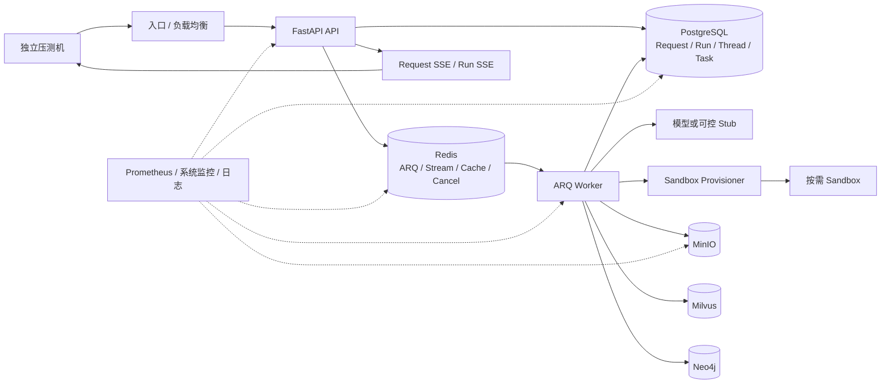

# Yuxi 内网部署压测与容量验证方案

> 适用范围：Yuxi 0.7.x，Docker Compose 或等价的单机/内网部署<br>
> 目标：得到可复现、可解释、可用于容量规划的结论，而不是只得到一个“最高并发数”<br>
> 更新日期：2026-09-17

本文是执行方案，不重复维护运行时实现细节。架构与参数发生变化时，应优先更新事实来源，再同步调整本方案：

- [系统架构](https://github.com/xerrors/Yuxi/blob/main/ARCHITECTURE.md)
- [生产部署](./advanced/deployment.md)
- [Agent 并发容量](./advanced/agent-concurrency-capacity.md)
- [性能评测规范](./develop-guides/testing-guidelines.md#性能评测)
- [Langfuse 集成](./advanced/langfuse-integration.md)

---

## 1. 压测目标与结论边界

### 1.1 目标

| 类别 | 要回答的问题 |
|---|---|
| 接入容量 | API 在目标到达率下的吞吐、延迟、错误率和拐点是什么？ |
| Agent 全链路 | 从 Request 提交、排队、Run 执行、SSE 输出到 PostgreSQL 终态是否完整且因果一致？ |
| 调度与隔离 | 同一 FIFO 域是否保持串行，不同用户/线程是否能并行，Sandbox 是否按预期创建和回收？ |
| 文件与知识库 | 原始文件上传、解析、切分、向量化、入库分别能承受多大负载？ |
| 稳定性 | 长时间稳态运行是否出现队列持续增长、资源不回落、连接池耗尽或 lease 异常？ |
| 故障恢复 | worker 中断、SSE 断线和依赖短暂异常后，系统能否收敛到一致终态？ |
| 容量规划 | 在既定硬件、模型、拓扑和 SLO 下，持续容量与短时突发容量分别是多少？ |

### 1.2 非目标

- 不把外部或内网 LLM 的极限吞吐归因于 Yuxi；平台容量和真实模型容量应分开测。
- 不用性能测试替代完整功能测试，但每次压测都必须验证结果绑定、终态和事件完整性等关键不变量。
- 不通过一次峰值成功宣称容量，也不以单次 HTTP 200 代表一次 Agent Run 成功。
- 不在共享环境中执行无范围的删库、清队列或对象存储清理。

### 1.3 完成标准

只有同时满足以下条件，某一负载档位才算通过：

1. 业务成功率、错误率和延迟满足压测前冻结的门槛。
2. Request、Run、Thread、唯一业务标记的关系完全一致。
3. PostgreSQL 权威终态与客户端观测一致，终态包括 `completed`、`failed`、`cancelled`、`interrupted`。
4. SSE 没有不可解释的事件丢失、重复终态或跨 Run 串流。
5. 队列深度和最老任务年龄在稳态窗口内没有持续正斜率。
6. 压测机自身没有饱和，也没有 `dropped_iterations` 等未施加成功的负载。
7. 停止流量后，队列、Sandbox、动态网络、数据库连接和内存能在约定时间内回落。
8. 相同档位至少重复三次，结果波动在可接受范围内。

---

## 2. 被测链路与关键约束

### 2.1 整体链路



正式报告必须说明流量走的是：

- **直连 API**：用于定位应用本身容量；或
- **生产等价入口**：包含反向代理、TLS、负载均衡、限流和网络路径，用于上线容量结论。

两类结果不可混在同一张容量表中。

### 2.2 FIFO 与并发口径

普通请求在同一用户、同一 Agent、同一 Thread 的 FIFO 域内串行。因而：

- “200 个 VU”不一定等于“200 个同时运行的 Run”；
- 测并行容量时，应准备足够多的独立用户/线程组合；
- 测 FIFO 时，应专门向同一 FIFO 域连续提交，并验证开始顺序、终态和无重叠执行；
- `reject`、`enqueue`、`steer` 等策略应分场景验证，不能混成一个吞吐数字。

### 2.3 两阶段状态与 SSE

Agent 请求至少包含两个阶段：

1. Request 已持久化，但可能仍在排队；
2. Request 关联到 Run，由 worker 持有 lease 并执行。

排队阶段订阅 `GET /api/agent/requests/{request_id}/events`；获得 `run_id` 后切换到
`GET /api/agent/runs/{run_id}/events`。Run SSE 支持基于游标恢复，Request SSE 是数据库状态轮询，二者不能当作同一条可重放流。

### 2.4 资源预算

压测前从目标环境展开后的 Compose 和实际副本数重新计算，不在本页复制易漂移的默认值。PostgreSQL 最坏连接预算至少包含：

```text
API 副本数 ×（API SQLAlchemy pool_size + max_overflow + API LangGraph pool）
+ worker 副本数 ×（worker SQLAlchemy pool_size + max_overflow + worker LangGraph pool）
+ migrator、健康检查、监控和人工运维预留
< PostgreSQL max_connections
```

当前默认值、实测基线和槽位解释以 [Agent 并发容量](./advanced/agent-concurrency-capacity.md)及目标 Compose 为准。`ARQ_MAX_JOBS` 是 AgentRun、Durable Task 和控制面工作共享的槽位上限，不应直接解释成同数量的纯业务 Run；Sandbox 又只在首次文件或命令操作时按需创建，因此“无工具对话”和“Sandbox Agent”必须分开报告。

---

## 3. 工具分工与负载模型

### 3.1 工具分工

| 工具 | 负责内容 | 不负责内容 |
|---|---|---|
| 仓库自带 `backend.test.performance load` | 严格的 Thread → Request SSE → Run SSE → 结果校验；唯一标记、因果关系、事件生命周期和终态 | 高到达率的通用 HTTP 接口轰压 |
| 仓库自带 `matrix` | 多用户、固定线程、多 worker 的隔离实验 | 日常快速冒烟；默认矩阵会产生大量真实模型请求 |
| k6 核心 | 登录、查询、提交、普通上传等 HTTP 到达率和容量阶梯 | 增量读取 SSE 事件、准确的首事件/断线恢复验证 |
| xk6-sse 或专用异步客户端 | 大规模 SSE 连接和断线重连专项 | 代替服务端终态与结果一致性校验 |
| Prometheus/系统工具/日志 | 服务端资源、队列、连接、错误与趋势 | 代替客户端端到端延迟 |
| Langfuse（可选） | 模型/Agent Trace、Span 和模型侧耗时对照 | 业务队列、数据库终态和基础设施指标的事实来源 |

不要用 k6 核心的 `http.get()` 假装流式消费 SSE：它会等待响应结束，无法逐事件记录首事件时间、游标和重连行为。全链路正确性优先使用仓库现有 harness；若必须用 k6 生态做 SSE，应从 [k6 扩展目录](https://grafana.com/docs/k6/latest/extensions/explore/)选择专用扩展（如 `xk6-sse`），单独构建并固定版本。

### 3.2 开放模型与封闭模型

- **容量、吞吐和排队测试**使用开放模型，如 `constant-arrival-rate` 或 `ramping-arrival-rate`。即使系统变慢，也继续按目标到达率施压；VU 预分配按 [arrival-rate VU allocation](https://grafana.com/docs/k6/latest/using-k6/scenarios/concepts/arrival-rate-vu-allocation/)校准。
- **固定并发和长连接测试**可使用封闭模型，如固定 VU；它适合描述同时在线数，不适合单独证明系统吞吐。
- 报告必须同时记录目标 RPS、实际发起 RPS、完成 RPS、`dropped_iterations` 和 VU 使用量。

使用封闭模型做吞吐阶梯会产生协调遗漏：系统越慢，客户端循环越慢，实际施加的请求反而越少，从而低估排队和尾延迟。具体差异见 k6 的[开放模型与封闭模型说明](https://grafana.com/docs/k6/latest/using-k6/scenarios/concepts/open-vs-closed/)。

---

## 4. 内网环境准备

### 4.1 固化版本和部署清单

每轮报告至少记录：

- Git commit、工作区是否干净、镜像 tag 与 digest；
- Compose 文件、env file 名、profile、副本数，以及只含非敏感字段的展开配置快照；
- 宿主机 CPU、内存、磁盘、Docker/内核版本；
- 数据库、Redis、MinIO、Milvus、Neo4j 的版本和资源限制；
- 模型供应商、模型名、配额、并发限制和是否 Stub；
- Sandbox 镜像、runtime profile、CPU/内存限制和地址池；
- 入口路径、压测机规格、两端时间同步状态；
- 数据规模：用户、线程、历史消息、知识库文档、向量和对象数量。

没有这些信息的并发数字不可用于容量外推。

### 4.2 离线镜像清单

不要从本机全部镜像中用正则筛选，容易漏掉 profile、Sandbox 或误打包无关镜像。镜像构建、清单、验证和实际启动必须使用同一份目标部署配置。下面以仓库生产 Compose 和 `.env.prod` 为例，并额外加入运行时按需使用的 Sandbox 镜像：

```bash
mkdir -p loadtest

docker compose --env-file .env.prod -f docker-compose.prod.yml --profile all \
  pull --ignore-buildable
docker compose --env-file .env.prod -f docker-compose.prod.yml --profile all \
  build
docker compose --env-file .env.prod -f docker-compose.prod.yml --profile all \
  config --images | sort -u > loadtest/images.txt

docker compose --env-file .env.prod -f docker-compose.prod.yml --profile all \
  config --format json \
  | jq -er '.services["sandbox-provisioner"].environment.SANDBOX_IMAGE' \
  >> loadtest/images.txt
sort -u -o loadtest/images.txt loadtest/images.txt

xargs docker image inspect < loadtest/images.txt > loadtest/image-inspect.json
xargs docker image save --output loadtest/yuxi-images.tar < loadtest/images.txt

if command -v sha256sum >/dev/null 2>&1; then
  sha256sum loadtest/yuxi-images.tar > loadtest/yuxi-images.tar.sha256
else
  shasum -a 256 loadtest/yuxi-images.tar > loadtest/yuxi-images.tar.sha256
fi
```

打包机需要 `jq`。Sandbox 镜像必须从 Compose 展开结果中提取；`--env-file` 不会把变量导出给当前 shell，直接读取 shell 的 `${SANDBOX_IMAGE}` 可能打包错误版本。监控、Langfuse、模型服务和可选解析服务若参与测试，也必须加入同一份清单。正式压测应固定 tag 或 digest，不使用 `latest`。

内网导入后验证：

```bash
if command -v sha256sum >/dev/null 2>&1; then
  sha256sum -c loadtest/yuxi-images.tar.sha256
else
  shasum -a 256 -c loadtest/yuxi-images.tar.sha256
fi
docker image load --input loadtest/yuxi-images.tar
docker compose --env-file .env.prod -f docker-compose.prod.yml --profile all \
  config --images
```

若目标环境使用其他 env file、Compose 文件或 profile，上述所有命令必须成套替换，不能在打包时使用开发 Compose、启动时再改用生产 Compose。生产 Web 镜像的构建 target 和启动命令与开发镜像不同；混用可能得到无法启动的离线包。具体环境隔离和必填变量见[生产部署](./advanced/deployment.md)。

### 4.3 使用生产等价拓扑

仓库默认 `docker-compose.yml` 面向开发：API 使用 Uvicorn `--reload`，worker 通过 `watchfiles` 启动，并挂载源码。开发热重载、开发 Web target 和 bind mount 都会污染容量结论。

正式压测直接以生产 Compose 为基线：

```bash
docker compose --env-file .env.prod -f docker-compose.prod.yml config --quiet
docker compose --env-file .env.prod -f docker-compose.prod.yml up -d
```

确需为压测增加资源限制、模型 Stub 或副本设置时，使用 `-f docker-compose.prod.yml -f loadtest.override.yml` 叠加最小覆盖。不要手写一份“近似生产”的完整拓扑，也不要重新引入开发源码挂载。

`docker compose config` 会把环境变量展开到输出中，可能包含 JWT、数据库、MinIO、Neo4j 和 Sandbox 密钥。**禁止归档或共享原始展开结果**。只保留字段白名单生成的非敏感快照，例如：

```bash
docker compose --env-file .env.prod -f docker-compose.prod.yml \
  config --format json \
  | jq '{name, services: (.services | with_entries(.value |= {
      image, user, ports, networks, deploy, cpus, mem_limit, restart
    }))}' \
  > loadtest/compose-sanitized.json
```

归档前人工复核该文件不含 `environment`、密码、Token、API Key、连接串和认证 Header，再计算并记录脱敏文件的 SHA-256。不要先把原始展开配置写到磁盘再做脱敏。

生产等价压测使用 `YUXI_ENV=production`，并在受保护的环境文件中配置独立、持久且足够长的安全密钥；不要依赖开发模式自动生成的临时值。最终容量轮必须使用计划上线的副本数、资源限制、入口、TLS 和负载均衡策略；不要在单进程直连结果上简单乘副本数。

### 4.4 模型分层

至少执行两组：

1. **可控 Stub**：固定首 Token 延迟、Token 速率、工具调用概率和错误注入，测 Yuxi 平台容量。
2. **真实内网模型**：测最终用户体验，同时单独记录模型服务的排队、GPU 利用率、限流和配额错误。

Stub 必须支持流式输出和可重复的唯一标记，不能只返回瞬时固定字符串，否则无法代表真实生命周期。

### 4.5 监控和数据库观测

建议采集 API、worker、PostgreSQL、Redis、MinIO、Docker/主机指标。监控镜像必须固定版本；Exporter 使用只读监控账户，凭证存放在受保护的环境文件或 Secret 中，不写进仓库和 Prometheus 配置。

若使用 `pg_stat_statements`：

1. 将扩展加入 PostgreSQL `shared_preload_libraries`；
2. 重启 PostgreSQL；
3. `CREATE EXTENSION IF NOT EXISTS pg_stat_statements;`；
4. 在每轮开始前记录/reset 统计，并保留慢 SQL 样本。

只执行 `CREATE EXTENSION` 而不预加载库，无法得到完整统计。MinIO 集群指标可能还需要 Bearer Token；不要把管理账号密码直接写入抓取配置。

### 4.6 身份与凭证

- API Key 前缀是 `yxkey_`，不是 `yxkey-`。
- 多用户容量测试使用多组测试用户/JWT或多把 API Key，并固定每个 VU 的身份和 Thread。
- 成功的 API Key 鉴权会更新 `last_used_at`；所有 VU 共用一把 Key 会制造额外的数据库热点，不应作为默认容量方案。
- 如果生产环境确实共用一把 Key，应额外设置“共享 Key 热点”专项，并与正常多身份结果分开。
- 测试凭证只放在本机受限文件或环境变量中，报告里必须脱敏。

---

## 5. 数据与可复现性

### 5.1 数据集

建立版本化的测试数据清单，至少覆盖：

- 空 Thread、短历史和长历史；
- 不使用 Sandbox 的普通对话；
- 固定执行时间的 Sandbox 工具调用；
- 合法且内容唯一的 Markdown、PDF、DOCX；
- 刚低于和刚高于 100 MiB 的上传边界；
- 不同文档数量、分块数量和向量规模的知识库。

用 `/dev/urandom` 生成并改后缀的“PDF”只适合原始二进制上传，不是合法解析样本。知识库会基于内容判断重复，单纯重命名相同内容仍可能返回冲突。

### 5.2 文件测试原则

- 1 KiB、1 MiB、10 MiB、近 100 MiB 等尺寸分别统计，不合并成一个 P95。
- k6 文件按官方 [`open()` init context](https://grafana.com/docs/k6/latest/javascript-api/init-context/open/)约束加载；大文件和每 VU 复制可能使压测机内存成为瓶颈。
- 解析测试使用可被目标解析器稳定解析的真实格式，文本内容中加入唯一标记。
- 上传成功、对象存在、数据库记录、解析完成、向量入库是不同阶段，分别计时和验收。

### 5.3 预热与时间同步

- 压测机与服务端使用 NTP/Chrony 同步；跨机器阶段耗时依赖时间同步。
- 预热镜像、模型、数据库页缓存和 Sandbox，预热结果不计入正式样本。
- 同时保留一组冷启动数据，报告镜像拉取、模型加载和首次 Sandbox 创建耗时。
- 压测机独立部署，正式轮次前做空响应校准，确认 CPU、网卡、文件描述符和端口没有先饱和。

---

## 6. 场景矩阵

| 编号 | 场景 | 负载模型 | 主要目的 | 关键验收 |
|---|---|---|---|---|
| S0 | 冒烟与基线 | 1 用户/1 请求 | 验证环境与指标 | ready、全链路、唯一标记、终态全通过 |
| S1 | 登录/只读 API | 开放到达率阶梯 | 接入层与数据库读容量 | RPS、P95/P99、错误率、PG 池 |
| S2 | Agent 提交 | 开放到达率阶梯 | Request 持久化与入队能力 | 提交延迟、实际 RPS、drop、积压趋势 |
| S3 | Agent 全链路 | 并发阶梯 | Run/SSE/模型/Sandbox 总容量 | 严格因果校验、首输出、总耗时、清理 |
| S4 | FIFO | 同一 FIFO 域突发 | 串行和顺序语义 | 顺序一致、无重叠、无丢失 |
| S5 | SSE 连接/重连 | 固定连接数+断线风暴 | Stream 和恢复能力 | 游标恢复、事件无缺口、终态一次 |
| S6 | Agent 附件上传 | 开放到达率，按尺寸分组 | API/MinIO 上传能力 | 状态码、对象完整性、吞吐、内存 |
| S7 | 知识库全链路 | 到达率+任务并发 | 上传、解析、切分、入库 | task 终态、文件状态、向量可检索 |
| S8 | 混合流量 | 生产比例 | 资源竞争和用户体验 | 各业务类别单独 SLO，不只看总平均 |
| S9 | 稳态/浸泡 | 可持续档位 2–8 小时 | 泄漏、漂移和长期积压 | 趋势斜率、资源回落、无持续积压 |
| S10 | worker/依赖故障 | 控制故障注入 | lease 与恢复语义 | 权威终态、无双写、ready 恢复 |

### 6.1 S0：冒烟

正式压测前必须用仓库自带全链路工具完成 1 并发：

- 创建独立 Thread；
- 提交带唯一标记的 Request；
- 先消费 Request SSE，再消费 Run SSE；
- 验证工具事件、响应标记、request/run 关联和结果 API；
- 确认 PostgreSQL 终态和 `/api/system/ready`；
- 确认本轮创建的 Thread、Sandbox 和动态网络已清理。

S0 失败时禁止继续加压。

### 6.2 S1/S2：接入与提交容量

使用 `ramping-arrival-rate` 从低到高阶梯施压，每档保持足够时间观察稳态。S2 只证明“接受并持久化请求”的容量，不等于 Run 完成容量。

必须同时记录：

- 目标、实际发起和完成 RPS；
- HTTP P50/P95/P99、错误率和错误码分类；
- `dropped_iterations`；
- Request 等待数、最老等待年龄、Run 启动率和完成率；
- API/worker/PG/Redis 资源与连接池等待；
- 停止提交后的 drain 时间。

若只持续提交而不等待或取消本轮 Request，会污染后续场景。每轮必须保存精确的 request/run/task ID 清单。

### 6.3 S3：Agent 全链路

建议并发阶梯：`1 → 10 → 20 → 50 → 100`，再根据硬件和前一档余量决定是否继续。普通对话与 Sandbox Agent 分开测，至少记录：

- 提交延迟；
- Request 排队时间；
- Run `dispatch_latency_ms`、`preparation_latency_ms`；
- 模型首输出和端到端首输出；
- 总耗时；
- 严格成功数、模型供应商失败、平台失败、校验失败；
- Sandbox 容器、网络、内存和回收时间。

### 6.4 S4：FIFO

向同一 FIFO 域快速提交一组带序号的请求，再向其他独立域提交对照组。验收：

- 同域开始顺序与提交顺序一致；
- 同域普通请求没有重叠运行；
- 独立域可以并行；
- 取消队首/队中请求后，剩余请求仍能正确推进；
- 每个 Request 只绑定期望 Run，结果标记不串线。

### 6.5 S5：SSE 与重连

专项客户端需要逐条读取事件并保存 `event id`、类型、时间和 payload 摘要：

1. Request 排队阶段连接 Request SSE；
2. 得到 `run_id` 后切换 Run SSE；
3. 在指定事件后主动断开；
4. 使用 Run SSE 的游标能力恢复；
5. 验证恢复后没有序列缺口，允许按协议处理重复事件；
6. 最终只接受一个终态，并与结果 API/PG 一致。

需要分别测稳定连接数和重连风暴。Request SSE 不支持与 Run SSE 完全相同的游标语义，不能声称它能用 `Last-Event-ID` 重放。

### 6.6 S6：附件上传

按文件尺寸和接口分别建场景，验证：

- 边界内文件成功，超限文件返回预期的用户可理解错误；
- MinIO 对象大小和校验值正确；
- API 内存没有随并发文件总大小无限增长；
- 客户端断开、重复上传和对象存储短暂失败后的状态可解释；
- 上传流量不会导致 Agent 控制面明显失去响应。

### 6.7 S7：知识库入库

知识库“上传成功”不等于“入库完成”。推荐链路：

1. `POST /api/knowledge/files/upload?kb_id=...` 上传原始文件；
2. 从上传响应读取 `file_path`、`content_hash` 和 `size`；
3. `POST /api/knowledge/databases/{kb_id}/documents` 提交文件项与解析参数，创建 `knowledge_ingest` 任务；
4. 使用返回的 `task_id` 轮询 `GET /api/tasks/{task_id}`；
5. Task 为 `success` 后，确认目标文件状态为 `indexed`；
6. 调用 `POST /api/knowledge/databases/{kb_id}/query`，验证预置唯一内容可以被召回；
7. 对 Task 失败、文件失败、重复内容、解析超时和重试分别分类。

`/documents` 的最小请求体如下。`items` 和两个映射的键必须是同一个上传响应 `file_path`；`auto_index` 不显式设为 `true` 时，任务默认只解析到 `parsed`，不会完成向量入库：

```json
{
  "items": ["<UPLOAD.file_path>"],
  "params": {
    "content_type": "file",
    "auto_index": true,
    "content_hashes": {
      "<UPLOAD.file_path>": "<UPLOAD.content_hash>"
    },
    "file_sizes": {
      "<UPLOAD.file_path>": 12345
    }
  }
}
```

`file_sizes` 的实际值使用上传响应中的数字，上面的尖括号只是占位说明。若设置 `chunk_preset_id` 或 `chunk_parser_config`，同一组对比轮必须固定这些参数。查询请求体至少包含 `{"query":"<唯一探针文本>","meta":{}}`。

上传耗时、排队耗时、解析耗时、Embedding 耗时、Milvus 写入耗时和可检索时间分别报告。

### 6.8 S8/S9：混合与浸泡

混合比例来自真实使用预测，例如只读、对话、Sandbox、上传、知识入库分别占多少；每类单独打标签并计算 SLO，不能用一个总体平均掩盖低频重任务。

30 分钟只适合作为校准或稳定性冒烟，不能证明没有内存泄漏。浸泡测试建议至少 2 小时，有条件执行 4–8 小时。预热后对以下指标计算趋势或分段斜率：

- RSS、容器内存、文件描述符、线程数；
- PG/Redis 连接和连接池等待；
- 队列深度、最老任务年龄、完成率；
- Sandbox/动态网络数量；
- 临时文件、MinIO 对象和数据库行增长；
- 停流后的资源回落时间和残留量。

“内存增长小于 10%”只能作为门槛之一，不能单独证明无泄漏。

### 6.9 S10：worker 故障恢复

每轮先从当前 worker 实现读取 Run lease、heartbeat 和 reconciliation 周期，并写入 manifest。故障测试等待时间必须大于实际 lease 过期时间加至少一个 reconciliation 周期；快速重启不能证明 lease 恢复。当前数值和实现解释以 [Agent 并发容量](./advanced/agent-concurrency-capacity.md)及 worker 源码为准。

在隔离环境中：

1. 启动一批足够长的 Run，记录 request/run ID；
2. 使用本轮目标 Compose 停止 worker，例如 `docker compose --env-file .env.prod -f docker-compose.prod.yml stop worker`，确认 worker 非 ready；
3. 等待超过 lease 过期与 reconciliation 窗口；
4. 使用同一组 Compose 参数启动 worker；
5. 验证 `worker_lease_expired`/attempt 状态、最终终态和重试策略；
6. 确认旧 owner 不再写入、没有重复结果或双重终态；
7. 确认 readiness、队列和资源回到基线。

Compose 的 `restart: unless-stopped` 可能让 `kill` 后的容器自动重启，因此应使用可控的 `stop/start`，并在报告中记录实际停机时长。

---

## 7. 关键 API 契约

脚本实现前应以源码为准，以下是当前需要特别注意的响应形状：

| 操作 | 当前契约/注意点 |
|---|---|
| readiness | `GET /api/system/ready`；不要用单纯进程存活代替接流量门禁 |
| 查询 Request | `GET /api/agent/requests/{request_id}` 返回 `{"request": {...}}`，`run_id` 位于 `request.run_id` |
| Request SSE | `GET /api/agent/requests/{request_id}/events`；用于等待派发，不具备 Run SSE 的完整游标重放语义 |
| Run SSE | `GET /api/agent/runs/{run_id}/events`；专项测试需记录事件 ID 和游标恢复 |
| Run 终态 | `completed`、`failed`、`cancelled`、`interrupted` 均为终态 |
| 原始知识文件上传 | 只完成上传/预处理元数据，不自动代表解析、Embedding 和向量入库完成 |
| 创建知识入库任务 | `POST /api/knowledge/databases/{kb_id}/documents` |
| 查询系统任务 | `GET /api/tasks/{task_id}` 返回 `{"task": {...}}` |

相关实现入口：

- [Agent Router](https://github.com/xerrors/Yuxi/blob/main/backend/server/routers/agent_router.py)
- [Knowledge Router](https://github.com/xerrors/Yuxi/blob/main/backend/server/routers/knowledge_router.py)
- [System Task Router](https://github.com/xerrors/Yuxi/blob/main/backend/server/routers/system_task_router.py)
- [Auth Middleware](https://github.com/xerrors/Yuxi/blob/main/backend/server/utils/auth_middleware.py)
- [Run Worker](https://github.com/xerrors/Yuxi/blob/main/backend/package/yuxi/services/run_worker.py)
- [Performance Load Harness](https://github.com/xerrors/Yuxi/blob/main/backend/test/performance/load.py)

---

## 8. 执行方法

### 8.1 全链路基线

在仓库根目录、使用项目要求的 Python 环境执行。工具要求设置 `YUXI_LOAD_API_KEY`，或者同时设置 `YUXI_LOAD_USERNAME` 和 `YUXI_LOAD_PASSWORD`；凭证从权限受限的本地环境文件或 Secret 注入，不写进命令、脚本和报告：

```bash
python -m backend.test.performance load \
  --base-url http://yuxi.internal:5050 \
  --scenario sandbox \
  --concurrency 1,10,20,50,100 \
  --task-seconds 20
```

如果压测机就是 Compose 宿主机，可按需增加 `--collect-local-resources`。跨机器压测时由 Prometheus/系统监控采集服务端资源，不要把“无法读取本机 Docker 指标”当成服务无资源消耗。

查看命令能力：

```bash
python -m backend.test.performance load --help
python -m backend.test.performance matrix --help
python -m backend.test.performance report --help
```

`matrix` 默认会产生大量真实模型请求，执行前先计算请求数、模型费用、时长和数据清理范围。

### 8.2 k6 提交容量骨架

`identities.json` 为受限文件，包含多组独立的 `token` 和预建 `thread_id`，不提交到仓库。下面脚本只测提交能力，不声称完成了 SSE/Run 全链路：

```javascript
import http from 'k6/http';
import { check } from 'k6';
import { SharedArray } from 'k6/data';

const identities = new SharedArray('identities', () =>
  JSON.parse(open('./identities.json'))
);

const baseUrl = __ENV.BASE_URL;
const agentSlug = __ENV.AGENT_SLUG;
const runPrefix = __ENV.RUN_PREFIX;

if (!baseUrl || !agentSlug || !runPrefix) {
  throw new Error('BASE_URL、AGENT_SLUG、RUN_PREFIX 均为必填；RUN_PREFIX 每轮必须唯一');
}

export const options = {
  scenarios: {
    submit: {
      executor: 'ramping-arrival-rate',
      startRate: 1,
      timeUnit: '1s',
      preAllocatedVUs: 50,
      maxVUs: 300,
      stages: [
        { target: 10, duration: '2m' },
        { target: 10, duration: '5m' },
        { target: 30, duration: '2m' },
        { target: 30, duration: '5m' },
      ],
    },
  },
  thresholds: {
    http_req_failed: ['rate<0.01'],
    http_req_duration: ['p(95)<1000'],
    dropped_iterations: ['count==0'],
  },
};

export default function () {
  const identity = identities[(__VU - 1) % identities.length];
  const requestId = `${runPrefix}-${__VU}-${__ITER}`;
  const payload = JSON.stringify({
    thread_id: identity.thread_id,
    agent_slug: agentSlug,
    query: `performance probe ${requestId}`,
    meta: { request_id: requestId },
    queue_policy: 'enqueue',
  });

  const res = http.post(`${baseUrl}/api/agent/runs`, payload, {
    headers: {
      Authorization: `Bearer ${identity.token}`,
      'Content-Type': 'application/json',
    },
    tags: { scenario: 'agent-submit' },
  });

  check(res, {
    'request accepted': (r) => r.status >= 200 && r.status < 300,
  });
}
```

执行时显式传入本轮唯一前缀，例如 `RUN_PREFIX=20260917T103000Z-s2-r1`，并把它写入 `manifest.json` 和 ID 清单。后端按 `meta.request_id` 幂等；跨轮复用前缀会命中旧 Request，使结果失真。字段名应在执行前用当前 OpenAPI/源码核对。若 `maxVUs` 大于身份数，多个 VU 会复用身份/线程并改变 FIFO 语义；应增加身份，而不是静默复用后仍把结果解释为独立并发。

### 8.3 每轮执行顺序

1. 固化版本、配置和数据快照。
2. 检查 `/api/system/ready`、worker 健康和依赖健康。
3. 记录空载基线与监控起止标记。
4. 预热，但不把预热数据计入正式结果。
5. 运行单一场景和单一档位。
6. 停止新流量，按本轮 ID 清单等待、取消或收敛任务。
7. 确认本轮范围内不存在 `queued`、`pending`、`running`、`cancel_requested`。
8. 等待资源和 readiness 回到基线，记录 drain 时间。
9. 导出客户端结果、日志、指标、数据库统计和配置快照。
10. 相同档位重复三次，再进入下一档。

不要用“固定等待 10 分钟后重启 worker”代替 drain。队列权威状态在 PostgreSQL，重启 worker 不会清空持久队列，还可能触发 lease 恢复并污染下一轮。

---

## 9. 指标与判定

### 9.1 客户端指标

- 目标/实际到达率、完成吞吐、VU、`dropped_iterations`；
- HTTP 状态码和错误原因分类；
- 提交、排队、准备、首输出、总耗时的 P50/P95/P99/最大值；
- SSE 连接成功率、断线率、重连时间、事件缺口和重复量；
- 严格成功、平台失败、模型失败、校验失败、超时和取消数量；
- 文件字节吞吐和各尺寸分组延迟。

### 9.2 服务端指标

- Request/Run 各状态数量、入队/启动/完成速率、最老等待年龄；
- ARQ 队列、执行槽和失败分类；
- lease 获取、heartbeat、过期、reconciliation 和重试；
- API/worker event-loop lag、连接池获取等待和超时；
- Sandbox 创建/删除时延、存活数、失败数、网络和资源；
- 知识任务各阶段耗时、重试和失败原因。

### 9.3 基础设施指标

| 组件 | 重点指标 |
|---|---|
| 主机/容器 | CPU、RSS、内存工作集、I/O、网络、FD、线程、OOM/重启 |
| PostgreSQL | active/idle/waiting、池等待、锁、慢 SQL、事务、WAL、缓存命中、磁盘延迟 |
| Redis | connected clients、ops/s、latency、内存、eviction、blocked clients、Stream 长度 |
| MinIO | 请求率、P95、错误、网络和磁盘吞吐、容量增长 |
| Milvus/Neo4j | 查询/写入延迟、错误、内存、磁盘和后台任务 |
| 模型服务 | 排队、TTFT、tokens/s、GPU、限流、配额和服务端错误 |

### 9.4 Langfuse 对照

Langfuse 可用于解释 Agent/模型阶段，但不替代 Request/Run/Task 的权威状态。建议在同一负载档位执行“关闭观测”和“开启观测”对照，比较：

- 端到端延迟和 CPU/网络开销；
- Trace 完整率和 flush 失败；
- Langfuse 不可用时是否影响业务请求；
- request/run/thread/user 等关联字段是否可检索且不泄露敏感内容。

具体配置遵循 [Langfuse 集成文档](./advanced/langfuse-integration.md)。

### 9.5 容量定义

“可持续容量”是最高一个同时满足以下条件的档位：

- 所有业务与正确性门槛通过；
- 队列深度和最老年龄无持续增长；
- 压测机没有丢负载；
- CPU、内存、连接、磁盘、网络保留约定余量；
- 连续重复三轮通过；
- 停流后在约定时间内 drain 并恢复基线。

第一个违反条件的档位是拐点候选，不是容量。短时突发峰值单独报告，不能替代持续容量。

门槛示例应在测试前根据业务 SLO 和硬件冻结，不在看到结果后修改：

| 指标 | 初始建议（示例） |
|---|---:|
| 接口错误率 | < 1% |
| 严格业务成功率 | ≥ 99% |
| k6 dropped iterations | 0 |
| readiness | 全程或按故障场景预期恢复 |
| 队列趋势 | 稳态窗口无持续正斜率 |
| 资源余量 | 不触发 OOM/池耗尽，并保留计划余量 |

固定毫秒阈值必须由目标用户体验、模型基线和网络路径决定；不能把其他机器的一次结果直接当作本环境 SLA。

---

## 10. 报告模板

每份正式报告至少包含：

1. **结论摘要**：可持续容量、突发容量、首个拐点和主要瓶颈。
2. **测试身份**：commit、镜像 digest、配置 hash、日期、执行人。
3. **拓扑与硬件**：入口、实例数、资源限制、依赖、压测机和网络。
4. **工作负载**：场景、数据规模、模型/Stub、到达率/并发、持续时间和预热。
5. **门槛**：压测前冻结的业务、性能、正确性和恢复条件。
6. **结果**：至少三轮原始值、P50/P95/P99、错误分类、资源峰值和趋势。
7. **因果分析**：客户端、API、队列、worker、模型、Sandbox、存储之间的证据链。
8. **恢复情况**：drain 时间、残留任务、资源回落和 readiness。
9. **限制**：未覆盖的 profile、故障、数据规模和模型配额。
10. **建议**：每项建议写明证据、预期收益、风险、回滚和复测方法。

推荐保留以下原始产物：

```text
loadtest-results/<run-id>/
├── manifest.json            # 版本、配置、硬件、数据和门槛
├── compose-sanitized.json   # 仅包含白名单非敏感字段的部署快照
├── client/                  # k6 / performance harness 原始输出
├── metrics/                 # Prometheus 快照或导出
├── logs/                    # 脱敏后的相关时间窗日志
├── database/                # pg_stat_statements、状态聚合、慢 SQL
├── ids/                     # 本轮 request/run/task/thread ID 清单
└── report.md                # 结论与图表
```

---

## 11. 执行前检查表

- [ ] commit、镜像 digest、Compose 非敏感快照和硬件已归档；原始展开配置未落盘。
- [ ] 已关闭 `--reload`/`watchfiles`，或明确本轮只测开发模式。
- [ ] `/api/system/ready`、worker 和所有依赖健康。
- [ ] PostgreSQL 总连接预算已按所有副本重算并留出运维余量。
- [ ] 压测机独立且校准通过，两端时间同步。
- [ ] 多身份、多线程数据已准备，API Key 不形成非预期热点。
- [ ] 模型 Stub/真实模型的目的、配额和错误口径已注明。
- [ ] 合法且内容唯一的文件数据已准备，尺寸分组明确。
- [ ] 监控账户只读，配置中没有明文管理凭证。
- [ ] 门槛在看到结果前已经冻结。
- [ ] 每轮 request/run/task/thread ID 可以追踪和定向清理。
- [ ] 先通过 S0，再逐档加压；上一档 drain 完成后才进入下一档。
- [ ] 故障注入只在隔离环境执行，恢复步骤和停止条件已演练。
- [ ] 报告同时给出吞吐、正确性、资源、队列趋势和恢复证据。

按此方案得到的是某一明确版本、硬件、模型、拓扑和工作负载下的容量证据。任何关键条件变化，都应重新跑对应场景，而不是线性外推旧结论。
